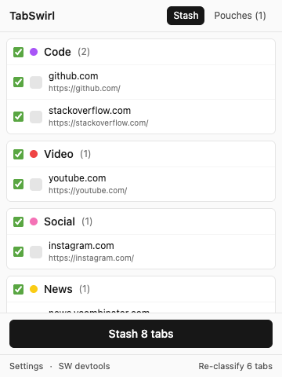
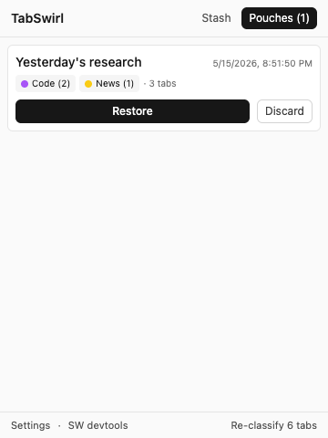
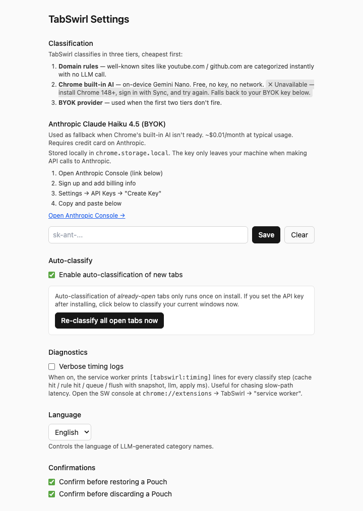

# TabSwirl


> AI-powered Chrome extension. Auto-classifies open tabs into color-coded
> groups, stashes them as **Pouches** that disappear when you restore them.

Two memory scales for your browser:

| Working memory | Long-term memory |
|---|---|
| The tabs you're using right now — auto-grouped into colored categories by an LLM (or a fast domain rule when possible). | Stashed bundles of tabs you might want back later. **Restoring a Pouch reopens the tabs and deletes the Pouch in the same step.** |

The "consume-on-restore" Pouch is the defining product semantic. No "session
graveyard" — once you take a Pouch out, it's gone.

<p align="center">
  
  &nbsp;
  
</p>

---

## Status

MVP-functional. Daily-driver-ready for the author; not yet on the Chrome
Web Store. Load it as an unpacked extension from `dist/` after `pnpm build`.

- 167/167 unit tests · 9/9 Playwright E2E tests on real Chromium
- All four PRD milestones (M1–M7) complete
- See [`docs/WORK_LOG.md`](docs/WORK_LOG.md) for the per-commit history

---

## Install (load unpacked)

```bash
git clone https://github.com/shw1606/tabswirl.git
cd tabswirl
pnpm install
pnpm build
```

Then in Chrome:

1. Open `chrome://extensions`
2. Toggle **Developer mode** (top-right)
3. **Load unpacked** → select the `dist/` directory
4. Pin TabSwirl to the toolbar for quick access

---

## Configure

Open the options page (popup → **Settings**, or right-click the toolbar icon).

<p align="center">
  
</p>

### LLM provider

TabSwirl runs a 3-tier classification cascade — most tabs never even reach
the LLM. The provider you pick here is just the fallback.

- **Anthropic Claude Haiku 4.5** (recommended) — BYOK. Sign up at
  [console.anthropic.com](https://console.anthropic.com), grab an API key,
  paste it in. Costs ~$0.01/month at typical use.

The free-tier **Google Gemini Flash-Lite** integration is in the codebase
but hidden from the UI — its 15–20 RPM rate limit doesn't fit continuous
tab classification. You can flip `chrome.storage.local["settings:main"]`
manually if you want it back.

### On-device AI (auto-detected)

If you're on Chrome 148+ with Sync enabled and history-sync on, the
extension automatically uses the built-in **Gemini Nano** model first
(no key, no network, runs locally). The options page shows ✓ Ready or
✗ Unavailable based on `LanguageModel.availability()`.

### Other knobs

- **Auto-classify** — on by default. Toggle off if you want manual control.
- **Language** — English / 한국어. Affects LLM-generated category names.
- **Verbose timing logs** — diagnostics. When on, the SW prints
  `[tabswirl:timing]` lines for every classify step.

---

## How classification works

```
 new tab opens
       │
       ▼
┌──────────────────────────────────────────────┐
│ T0  Domain cache              ~10ms          │
│     Have we seen this domain in this window? │
│     If yes → join the cached group. Done.    │
└──────────────────────────────────────────────┘
       │ miss
       ▼
┌──────────────────────────────────────────────┐
│ T1  Hardcoded domain rules    ~30ms          │
│     ~210 well-known domains across 9 cats:   │
│       Code · AI · Social · Video · News      │
│       Shopping · Productivity · Finance      │
│       Entertainment                          │
│     Hit → apply group + seed cache. Done.    │
└──────────────────────────────────────────────┘
       │ miss
       ▼
┌──────────────────────────────────────────────┐
│ T2  Chrome built-in AI        ~100ms         │
│     Gemini Nano on-device. No key, no net.   │
│     Skipped if LanguageModel.availability()  │
│     isn't "available".                       │
└──────────────────────────────────────────────┘
       │ unavailable / fail
       ▼
┌──────────────────────────────────────────────┐
│ T3  BYOK provider             ~500-1500ms    │
│     Anthropic Claude Haiku 4.5 by default.   │
│     500ms debounce batches sibling tabs.     │
└──────────────────────────────────────────────┘
       │ all paths exhausted
       ▼
   tab stays ungrouped (silent fallback per PRD §6.3)
```

The cache also **learns from manual moves**: drag a tab into a different
group, and the next same-domain tab takes the T0 fast path into the group
you chose.

---

## Stash & Restore (the Pouch flow)

```
tabs in toolbar           Pouches (chrome.storage.local)
       ↓ Stash                    ↑   ↓ Restore
       └──── tab metadata ────────┘
            (groups + colors)         and the Pouch is deleted
```

1. Click the toolbar icon → see the current window's grouped tabs
2. Pick which groups/tabs to stash → click **Stash N tabs**
3. Tabs close, Pouch is saved to `chrome.storage.local`
4. Later: open the popup → **Pouches** tab → **Restore** → tabs reopen
   with their original groups, **and the Pouch disappears**

Stash never calls the LLM — it just freezes the existing classification.

---

## Development

```bash
pnpm install     # deps
pnpm dev         # vite + crxjs HMR. dist/ stays in sync; reload in chrome://extensions
pnpm build       # production bundle → dist/
pnpm test        # vitest (unit, fast)
pnpm typecheck   # tsc --noEmit
pnpm e2e         # playwright (real Chromium with the extension loaded)
pnpm e2e:build   # build then e2e
```

### Stack

- Manifest V3 Chrome extension
- TypeScript (strict)
- Vite + [`@crxjs/vite-plugin`](https://crxjs.dev/vite-plugin)
- React + Tailwind CSS for the popup and options page
- Vitest for unit tests, Playwright for E2E
- Anthropic + Gemini APIs via raw `fetch` (no SDK — keeps the SW lean)

### Layout

```
src/
  background/          MV3 service worker + listeners
  core/                pure logic shared by SW and UI
    domain-rules.ts      ~210 domain → category rules (Tier 1)
    pouch-store.ts       chrome.storage.local CRUD for Pouches
    types.ts             data model (Settings, Pouch, …)
  llm/                 provider abstraction
    provider.ts          LlmProvider interface + cascade
    anthropic.ts         Claude Haiku 4.5
    chrome-ai.ts         Chrome built-in Prompt API
    gemini.ts            (hidden from UI — see configure section)
    validate.ts          shared response validator
  popup/               React popup UI
  options/             React options page
e2e/                   Playwright specs
tests/                 Vitest specs
docs/
  PRD.md               product spec (single source of truth)
  WORK_LOG.md          per-commit history with decisions/why
CLAUDE.md              operating guide for AI co-development
```

### Commit cadence

Work is split into commit-sized units, each followed by a `WORK_LOG.md`
entry. See `CLAUDE.md` for the rules and `docs/WORK_LOG.md` for what's
been done.

---

## License

[MIT](LICENSE).
